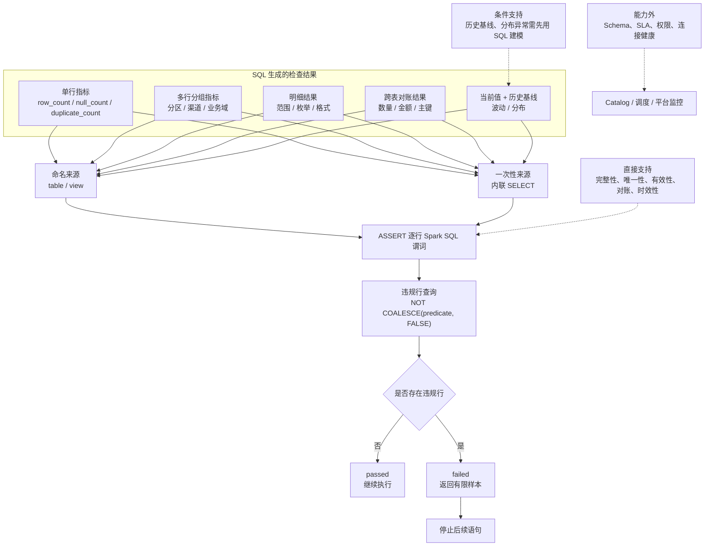

# 数据质量 Assert

SparkOne 使用薄 DSL 完成结果检查。稳定、可复用的检查推荐先生成结果表：

```sql
assert result_table
where "<Spark SQL predicate>"
message "<failure message>";
```

一次性检查也可以直接内联完整查询：

```sql
assert (
  <Spark SQL SELECT>
)
where "<Spark SQL predicate>"
message "<failure message>";
```

两种写法具有完全相同的语义。`where` 是结果中每一行必须满足的布尔表达式，不是
普通筛选条件；SparkOne 不引入第二套表达式语言，也不要求结果必须恰好一行。

## 语义

编译器把 `assert` 转成违规行查询：

```sql
SELECT *
FROM result_table
WHERE NOT COALESCE((<predicate>), FALSE)
```

内联查询只是在编译期替换结果表来源：

```sql
SELECT *
FROM (
  <Spark SQL SELECT>
) sparkone_assert_input
WHERE NOT COALESCE((<predicate>), FALSE)
```

| 查询结果 | Assert 状态 | 脚本行为 |
| --- | --- | --- |
| 0 行 | `passed` | 检查通过，继续执行后续语句。 |
| 1 行或更多 | `failed` | 检查失败，返回受 `preview.maxRows` 限制的违规样本，停止后续语句。 |
| 违规行查询执行异常 | `error` | 返回真实错误并停止后续语句。 |

补充约定：

- 谓词结果为 `NULL` 时按违规处理。
- 空结果表没有违规行，因此默认通过。需要检查“必须有数据”时，应在指标表中显式生成
  `row_count` 并断言 `row_count > 0`。
- `message` 是业务失败信息；服务端异常仍记录失败语句、上下文和异常堆栈。
- 业务失败日志只记录表名、谓词和消息，不记录违规行内容。
- Local 和 Kyuubi 使用相同编译结果与短路语义。

## View 与内联查询

`view + assert` 是基础形式，适合需要复用、单独预览或分步排查的检查结果：

```sql
view partition_metrics as
select dt, count(*) as row_count
from orders
group by dt;

assert partition_metrics
where "row_count > 0"
message "存在空分区";
```

内联查询是相同执行模型的语法糖，适合只使用一次的检查：

```sql
assert (
  select dt, count(*) as row_count
  from orders
  group by dt
)
where "row_count > 0"
message "存在空分区";
```

内层可以使用聚合、Join、CTE、窗口函数和子查询。ANTLR 只识别括号边界，完整查询
仍由 Spark SQL parser 校验。内联查询不会创建临时视图，也不会触发
`save -> reload -> verify`。

## 为什么不限制为一行

单行指标表很适合全表检查：

```sql
view order_metrics as
select
  count(*) as row_count,
  count_if(order_id is null) as null_count,
  count(*) - count(distinct order_id) as duplicate_count
from orders;

assert order_metrics
where "row_count > 0 and null_count = 0 and duplicate_count = 0"
message "订单表完整性检查失败";
```

但“逐行谓词”还可以直接覆盖更多结果形态：

```sql
view partition_metrics as
select dt, count(*) as row_count
from orders
group by dt;

assert partition_metrics
where "row_count > 0"
message "存在空分区";
```

每一行代表一个分区、业务域、渠道或其他检查单元。任意一行不满足谓词，整条
`assert` 失败，并把对应行作为诊断样本返回。

## 常用建模方式

| 场景 | 结果表形态 | 谓词示例 | 支持方式 |
| --- | --- | --- | --- |
| 行数、空值、重复值 | 单行指标 | `row_count > 0 and null_count = 0` | 直接支持 |
| 分区或分组完整性 | 每组一行 | `row_count >= 100` | 直接支持 |
| 字段范围、枚举、格式 | 明细行或分组指标 | `amount >= 0 and status in (...)` | 直接支持 |
| 跨表行数或金额对账 | 每个对账键一行 | `left_amount = right_amount` | 直接支持 |
| 数据时效性 | 单行或每分区一行 | `max_event_time >= current_timestamp() - interval 1 hour` | 直接支持 |
| 历史波动、分布异常 | 当前值与基线连接后的结果 | `abs(rate - baseline_rate) <= tolerance` | 条件支持，需要基线表或 SQL 预计算 |
| Schema 演进 | 表结构元数据 | 不适合行谓词 | 不支持，应由 catalog/schema 合同处理 |
| 调度 SLA、连接健康、权限 | 平台运行状态 | 不适合结果表谓词 | 不支持，应由调度和平台监控处理 |

## 能力支持图



## 运行结果

每条 `assert` 的 statement 结果包含：

```json
{
  "success": false,
  "error": "订单表完整性检查失败",
  "assertion": {
    "table": "order_metrics",
    "predicate": "row_count > 0 and null_count = 0",
    "status": "failed",
    "message": "订单表完整性检查失败"
  },
  "schema": [],
  "rows": [],
  "truncated": false
}
```

失败时 `schema` 和 `rows` 是违规样本；示例省略了实际列。通过时前端只展示检查
状态，不展示空的违规结果表。为保持 API 兼容，内联查询的 `assertion.table` 显示为
`inline query`。

## 明确不做

- 不增加 `expect`、`warn` 或规则中心。
- 不把检查结果自动 `save -> reload -> verify`。
- 不替代 Spark SQL parser。
- 不提供内置指标函数或历史基线存储；这些仍需通过 `view` 或内联 SELECT 使用普通
  Spark SQL 生成。

这样可以把数据质量能力保持为 SQL 工作流中的一个失败门，同时不把 SparkOne
演进成独立的数据质量运行时。
