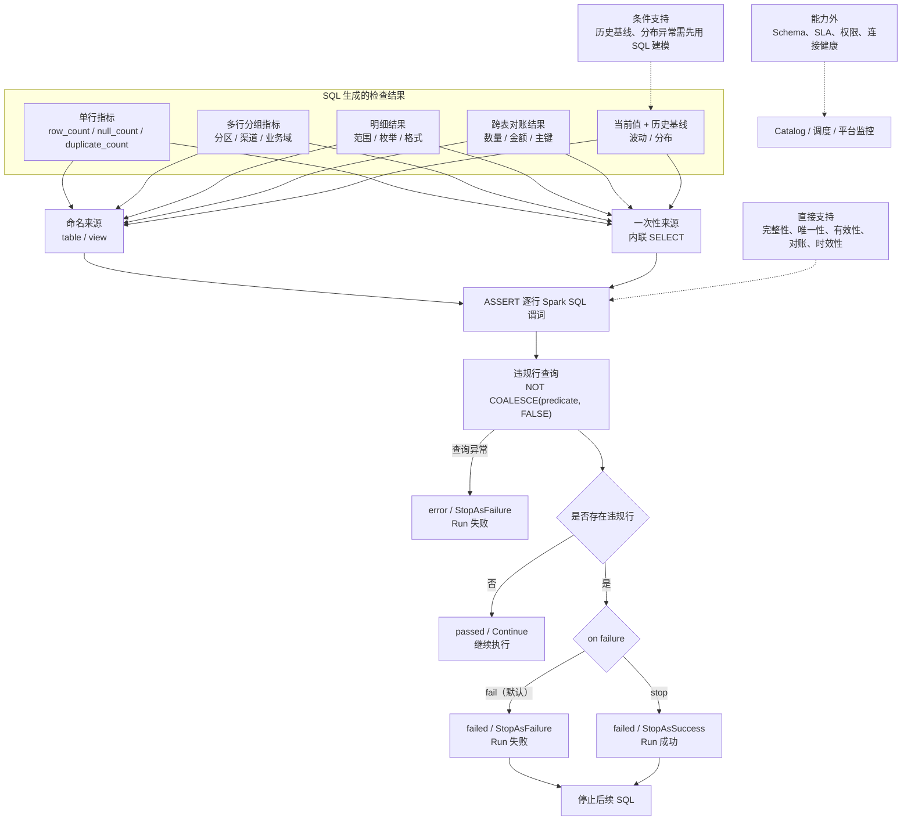

# 数据质量 Assert

QueryOne 使用薄 DSL 完成结果检查。稳定、可复用的检查推荐先生成结果表：

```sql
assert result_table
where "<Spark SQL predicate>"
message "<failure message>"
on failure fail;
```

一次性检查也可以直接内联完整查询：

```sql
assert (
  <Spark SQL SELECT>
)
where "<Spark SQL predicate>"
message "<failure message>"
on failure stop;
```

`on failure` 可以省略，默认值是 `fail`。两种数据来源具有完全相同的检查和失败动作
语义。`where` 是结果中每一行必须满足的布尔表达式，不是普通筛选条件；QueryOne
不引入第二套表达式语言，也不要求结果必须恰好一行。

## 语义

编译器把 `assert` 转成违规行查询：

```sql
SELECT *
FROM result_table
WHERE NOT COALESCE((<predicate>), FALSE)
```

内联查询只是在编译期替换结果表来源：

```sql
SELECT *
FROM (
  <Spark SQL SELECT>
) queryone_assert_input
WHERE NOT COALESCE((<predicate>), FALSE)
```

| 查询结果 | Assert 状态 | 脚本行为 |
| --- | --- | --- |
| 0 行 | `passed` | 检查通过，继续执行后续语句。 |
| 1 行或更多 | `failed` | 返回受 `preview.maxRows` 限制的违规样本，并按 `on failure` 停止脚本。 |
| 违规行查询执行异常 | `error` | 返回真实错误并停止脚本；不受 `on failure stop` 影响。 |

## 失败动作与三态控制

`on failure` 只控制“查询成功执行，但发现违规行”这种主动检查失败：

| 场景 | `on failure` | 单条 statement | 整次 Run | `outcome` | 后续 SQL |
| --- | --- | --- | --- | --- | --- |
| 无违规行 | `fail` 或 `stop` | `success=true`、`passed` | `success=true` | `succeeded` | 继续 |
| 有违规行 | 省略或 `fail` | `success=false`、`failed` | `success=false` | `assertion_failed` | 停止 |
| 有违规行 | `stop` | `success=false`、`failed` | `success=true` | `assertion_stopped` | 停止 |
| SQL、连接、权限等执行异常 | `fail` 或 `stop` | `success=false`、`error` | `success=false` | `execution_error` | 停止 |

runtime 内部只做三个控制决策：

- `Continue`：当前语句成功，继续脚本。
- `StopAsSuccess`：检查未通过且动作是 `stop`，停止脚本，但整次 Run 成功。
- `StopAsFailure`：默认检查失败或任意执行异常，停止脚本且整次 Run 失败。

这三个状态刻意把“单条检查事实”和“任务调度结果”分开。`on failure stop` 不会把检查
伪装成通过：对应 assert statement 仍是 `success=false`、`status=failed`，违规样本和
`message` 也完整保留，通知系统可以根据 `outcome=assertion_stopped` 定向发送数据质量
通知。

需要注意两个边界：

- `stop` 只停止同一脚本中尚未执行的 SQL。由于整次 Run 成功，外部调度 DAG 是否继续
  执行下游节点由调度器决定；需要阻断 DAG 下游时应使用默认的 `fail`，或让调度器显式
  判断 `outcome`。
- `assert` 不是事务边界。它之前已经完成的查询或写入不会回滚，只保证它之后的语句
  不再执行。

补充约定：

- 谓词结果为 `NULL` 时按违规处理。
- 空结果表没有违规行，因此默认通过。需要检查“必须有数据”时，应在指标表中显式生成
  `row_count` 并断言 `row_count > 0`。
- `message` 是业务失败信息；服务端异常仍记录失败语句、上下文和异常堆栈。
- 业务失败日志只记录表名、谓词和消息，不记录违规行内容。
- Local 和 Kyuubi 使用相同编译结果与短路语义。

## View 与内联查询

`view + assert` 是基础形式，适合需要复用、单独预览或分步排查的检查结果：

```sql
view partition_metrics as
select dt, count(*) as row_count
from orders
group by dt;

assert partition_metrics
where "row_count > 0"
message "存在空分区";
```

内联查询是相同执行模型的语法糖，适合只使用一次的检查：

```sql
assert (
  select dt, count(*) as row_count
  from orders
  group by dt
)
where "row_count > 0"
message "存在空分区";
```

内层可以使用聚合、Join、CTE、窗口函数和子查询。ANTLR 只识别括号边界，完整查询
仍由 Spark SQL parser 校验。内联查询不会创建临时视图，也不会触发
`save -> reload -> verify`。

## 为什么不限制为一行

单行指标表很适合全表检查：

```sql
view order_metrics as
select
  count(*) as row_count,
  count_if(order_id is null) as null_count,
  count(*) - count(distinct order_id) as duplicate_count
from orders;

assert order_metrics
where "row_count > 0 and null_count = 0 and duplicate_count = 0"
message "订单表完整性检查失败";
```

但“逐行谓词”还可以直接覆盖更多结果形态：

```sql
view partition_metrics as
select dt, count(*) as row_count
from orders
group by dt;

assert partition_metrics
where "row_count > 0"
message "存在空分区";
```

每一行代表一个分区、业务域、渠道或其他检查单元。任意一行不满足谓词，整条
`assert` 失败，并把对应行作为诊断样本返回。

## 常用建模方式

| 场景 | 结果表形态 | 谓词示例 | 支持方式 |
| --- | --- | --- | --- |
| 行数、空值、重复值 | 单行指标 | `row_count > 0 and null_count = 0` | 直接支持 |
| 分区或分组完整性 | 每组一行 | `row_count >= 100` | 直接支持 |
| 字段范围、枚举、格式 | 明细行或分组指标 | `amount >= 0 and status in (...)` | 直接支持 |
| 跨表行数或金额对账 | 每个对账键一行 | `left_amount = right_amount` | 直接支持 |
| 数据时效性 | 单行或每分区一行 | `max_event_time >= current_timestamp() - interval 1 hour` | 直接支持 |
| 历史波动、分布异常 | 当前值与基线连接后的结果 | `abs(rate - baseline_rate) <= tolerance` | 条件支持，需要基线表或 SQL 预计算 |
| Schema 演进 | 表结构元数据 | 不适合行谓词 | 不支持，应由 catalog/schema 合同处理 |
| 调度 SLA、连接健康、权限 | 平台运行状态 | 不适合结果表谓词 | 不支持，应由调度和平台监控处理 |

## 能力支持图



## 运行结果

例如 `on failure stop` 命中违规行且后面仍有 SQL 时，`/api/run` 返回：

```json
{
  "success": true,
  "outcome": "assertion_stopped",
  "stoppedEarly": true,
  "statements": [
    {
      "success": false,
      "error": "订单表完整性检查失败",
      "assertion": {
        "table": "order_metrics",
        "predicate": "row_count > 0 and null_count = 0",
        "status": "failed",
        "message": "订单表完整性检查失败",
        "failureAction": "stop"
      },
      "schema": [],
      "rows": [],
      "truncated": false
    }
  ]
}
```

失败时 `schema` 和 `rows` 是违规样本；示例省略了实际列。通过时前端只展示检查
状态，不展示空的违规结果表。为保持 API 兼容，内联查询的 `assertion.table` 显示为
`inline query`。`stoppedEarly` 只表示确实存在未执行的后续 SQL；assert 恰好是最后一条
语句时，即使它触发停止决策，该字段也是 `false`。

`/api/run` 的运行结果使用响应体表达成功或失败，调度接入不能只判断 HTTP 请求是否
成功，还必须读取 `success` 和 `outcome`。

## 明确不做

- 不增加 `expect`、`warn`、继续执行模式或规则中心。
- 不把检查结果自动 `save -> reload -> verify`。
- 不替代 Spark SQL parser。
- 不提供内置指标函数或历史基线存储；这些仍需通过 `view` 或内联 SELECT 使用普通
  Spark SQL 生成。

这样可以把数据质量能力保持为 SQL 工作流中的一个失败门，同时不把 QueryOne
演进成独立的数据质量运行时。
